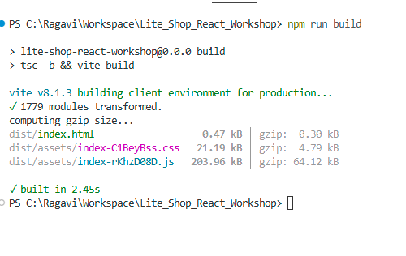

# LITE.SHOP React Workshop

This project is a React + Vite + TypeScript + Tailwind CSS application.  
The goal was to recreate the layout from the given index.html file using reusable React components.

## Components Created

### Header
The Header component contains the logo, navigation links, search box, cart icon, user icon, and mobile menu icon.

### Sidebar
The Sidebar component contains the filter section. It includes categories, price range, availability options, and a summer sale card.

### ProductSection
The ProductSection component displays the page title, sort dropdown, and product grid.

### ProductCard
The ProductCard component is a reusable component used to display each product.  
It receives product details using props.

Props used:
- product name
- category
- price
- old price
- status
- rating
- badge
- image
- sold out status

Props are used because the same card design is repeated for many products, but the data is different.

### Newsletter
The Newsletter component contains the subscription section.

### Footer
The Footer component contains the brand details and copyright text.

## Why Props Are Used

Props are used to pass product data from the product list to the ProductCard component.  
This makes the card reusable and avoids writing the same HTML multiple times.

## How Components Work Together

App.tsx is the main component.  
It combines Header, Sidebar, ProductSection, Newsletter, and Footer.

ProductSection imports the products data and sends each product to ProductCard using props.

## Technologies Used

- React
- Vite
- TypeScript
- Tailwind CSS
- lucide-react

## How to Run

Install dependencies:

npm install

Run the project:

npm run dev

Open the localhost URL shown in the terminal.

## Build Status

